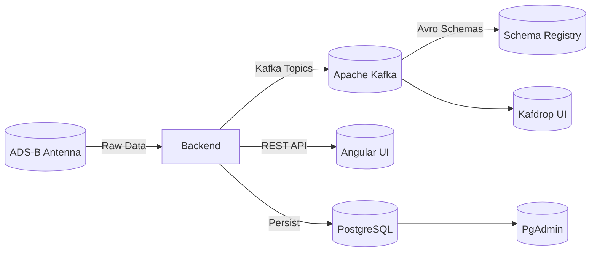

# ✈️ FlightApp – Backend & Orchestration

This repository contains the **backend of the Flight Tracker project** along with a `docker-compose.yaml` file to spin up the full environment (database, Kafka, schema registry, frontend, etc.).

## 🌍 Overview

**FlightApp** is a real-time flight tracking system that ingests ADS-B (Mode-S) messages, processes them with **Apache Kafka**, enriches flight data using the **AeroDataBox API**, and persists information into **PostgreSQL**.

The **Angular frontend** visualizes in real time the air traffic detected over Tower Hamlets (London).  
The original motivation came from noticing an increase in local air traffic and wanting to verify it with concrete data.

The project exposes a **Spring Boot REST API** that serves as the backend for the Angular frontend (*flight-tracker-ui*).

## 🏗️ Architecture



### Main Components

- **Backend (this repo)** → Spring Boot **3.5.3** + **Java 17** + Kafka + Avro + PostgreSQL  
- **Frontend (separate repo)** → Angular 17 + Angular Material  
- **Infrastructure (docker-compose)** → Spins up:
  - Zookeeper + Kafka (**Confluent Platform 7.5.0**)
  - Confluent Schema Registry
  - Kafdrop (Kafka UI)
  - PostgreSQL 15
  - PgAdmin
  - Backend API
  - Frontend (Nginx + Angular build)

---

## ⚙️ Technology Stack

- ☕ **Java 17**
- 🌱 **Spring Boot 3.5.x**
- 📦 **Spring Data JPA + Hibernate**
- 🗄️ **PostgreSQL 15 + Flyway**
- 🐳 **Docker Compose** for orchestration
- 📡 **Apache Kafka (Confluent 7.5.0)**
- 📑 **Avro Schemas** (Confluent `kafka-avro-serializer`)
- 📊 **PgAdmin** for DB management
- 👀 **Kafdrop** for Kafka topic exploration
- 🌍 **AeroDataBox API** (route resolution: origin/destination)
- 🎨 **Lombok** (to simplify DTOs and entities)
- 🧪 **JUnit / Spring Boot Test / spring-kafka-test**

---

## 📂 Code Structure

### Controllers

- `FlightOverHomeController` → exposes recent flights  
- `OpsController` → manual job execution (e.g., route backfill)

### Services

- `FlightProcessorService` → processes and normalizes ADS-B messages  
- `FlightOverHomeService` → persists flights and enriches data  
- `RouteResolverServiceImpl` → resolves routes via cache/DB/external API  
- `BackfillRouteJob` → scheduled job completing flights missing route info  

### Repositories

- `FlightOverHomeRepository` → flights detected “over home”  
- `FlightRouteCacheRepository` → persistent route cache  
- `FlightsPerHourRepository` → hourly stats  
- `DeadLetterRepository` → failed messages storage  

### Flyway Migrations

- V1…Vn → define tables (`flight_over_home`, `flights_per_hour`, `flight_route_cache`, etc.)

---

## 🧰 Configuration

### Environment Variables

These are passed to the **backend** service via Docker Compose:

- `SPRING_DATASOURCE_URL=jdbc:postgresql://postgres:5432/flights_db`  
- `SPRING_DATASOURCE_USERNAME=postgres`  
- `SPRING_DATASOURCE_PASSWORD=postgres`  
- `AERODATABOX_API_KEY=<your_api_key>`  
- `SPRING_KAFKA_BOOTSTRAP_SERVERS=kafka:9092`  
- `SPRING_KAFKA_PROPERTIES_SCHEMA_REGISTRY_URL=http://schema-registry:8081`  
- `SPRING_KAFKA_PRODUCER_PROPERTIES_SCHEMA_REGISTRY_URL=http://schema-registry:8081`  
- `SPRING_KAFKA_CONSUMER_PROPERTIES_SCHEMA_REGISTRY_URL=http://schema-registry:8081`  

**Optional antenna socket (Mode-S Beast / port 30003):**

- `FLIGHT_SOCKET_ENABLED=true`  
- `FLIGHT_SOCKET_HOST=192.168.8.236`  
- `FLIGHT_SOCKET_PORT=30003`  
- `FLIGHT_SOCKET_CONNECT_TIMEOUT_MS=3000`  
- `FLIGHT_SOCKET_READ_TIMEOUT_MS=5000`  
- `FLIGHT_SOCKET_RECONNECT_BACKOFF_MS=1000`  

> Tip: You can put `AERODATABOX_API_KEY` in a local `.env` file and reference it from Compose.

### Kafka Ports

- External access from host: **`localhost:29092`**  
- Internal Docker network (services): **`kafka:9092`**  

---

## 🚀 Running the Environment

### Requirements

- **Java 17**
- **Maven 3.9+**
- **Docker + Docker Compose**

### 1) Build the backend

```bash
./mvnw clean package -DskipTests
```

### 2) Start the full stack with Docker

```bash
docker compose up --build
```

This launches:

- Backend → <http://localhost:8080>  
- Frontend → <http://localhost:8088>  
- Kafdrop → <http://localhost:9000>  
- PgAdmin → <http://localhost:5050>  

### 3) Test the API

```bash
curl http://localhost:8080/flights/over-home
```

---

## 🧩 Improvements / Next Steps

- ✅ **Basic integration working** (backend + frontend + DB + Kafka)  
- 🛠️ **Unit & integration tests**:
  - Test `FlightProcessorService`
  - Test `RouteResolverService` with external API mocks
  - Repository tests with Testcontainers
- 📈 **Enhanced statistics**:
  - Persist more metrics (flights per airline, most frequent routes)
- 🔄 **Retry & resilience**:
  - Improve error handling in Kafka consumers
  - Add retry logic in `BackfillRouteJob`
- 🔑 **Secrets management**:
  - Use `.env` for `AERODATABOX_API_KEY` (avoid hardcoding)
- 📦 **CI/CD**:
  - GitHub Actions workflow for automated build/test
- 🖥️ **Frontend**:
  - Improve stats UI (map, charts)
- 🔍 **Logging/Monitoring**:
  - Add Prometheus + Grafana (pending)

---

## 📌 Notes

- The `docker-compose.yaml` is included in this repo so that developers can run the full environment locally without relying on multiple repositories.  
- The frontend (`flight-tracker-ui`) has its own repository but is also built as part of the `docker-compose` stack.

---